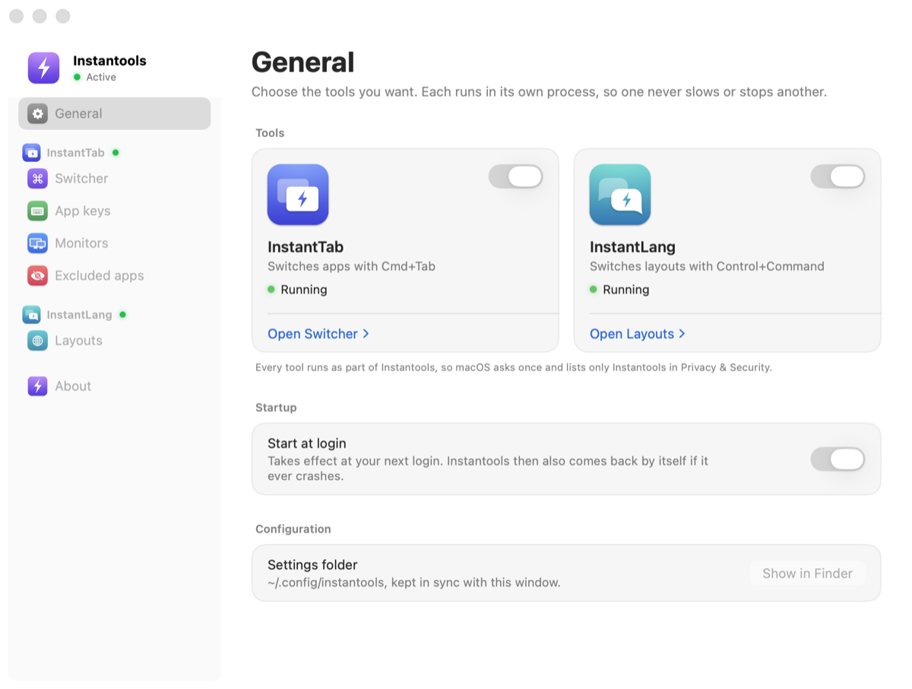
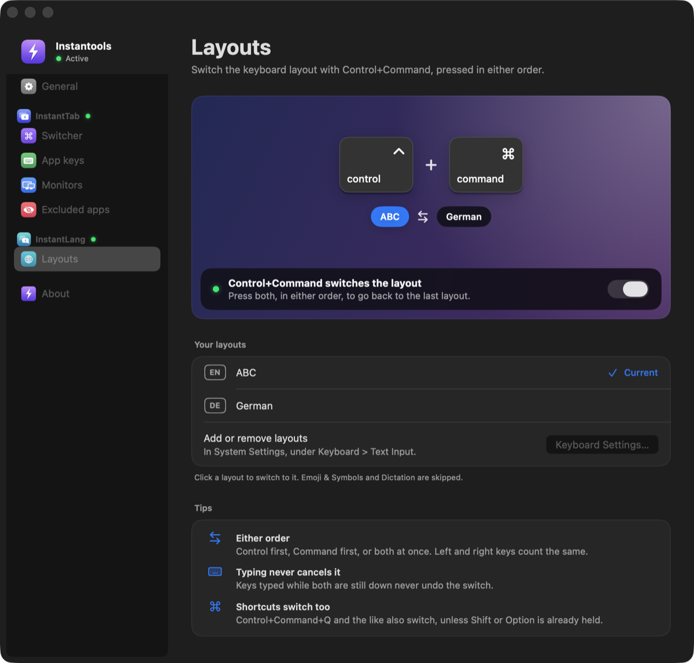

<p align="center">
  
</p>

<h1 align="center">Instantools</h1>

<p align="center">
  Mac tools that respond the moment you press them.
</p>

<p align="center">
  
  
  
  
</p>

<p align="center">
  
</p>

Instantools is one menu bar app with two tools. Turn on only the ones you want:

| | Tool | What it does |
|---|---|---|
|  | **InstantTab** | An app switcher that appears the moment you press Cmd+Tab |
|  | **InstantLang** | Switches the keyboard layout with Control+Command, pressed in either order |

Both come with one Settings window, one login item and one set of permissions. Each tool runs in its own process, so one never slows or stops another. Instantools succeeds the standalone InstantTab and InstantLang apps, and takes over from them on its first launch.

## InstantTab

An app switcher with the control macOS leaves out.

- **Instant.** The switcher is drawn in time for the next display frame. Nothing is looked up when you press Tab: apps and windows are tracked in the background and the panel is built once at launch.
- **Monitor aware.** List apps from every monitor, the one under the mouse, the one you are working on, or a group of monitors defined by rules like "external" or "portrait", so it keeps working when you swap monitors.
- **Straight to an app.** Bind a key to an app, then Cmd+Tab and that key goes right to it, or opens it if it is not running.
- **Yours to shape.** Exclude apps always or only when they have no window, let apps like virtual machines keep Cmd+Tab, set the show delay, and preview the icon size live.
- **Safe.** Native Cmd+Tab comes back whenever InstantTab is turned off, quits, hangs or crashes.

| | |
|---|---|
| **Cmd+Tab** | Hold Cmd, press Tab to move, release to switch |
| **Quick Cmd+Tab** | Jump to the previous app without drawing anything |
| **Shift, \`, arrows** | Move back, or move with the arrow keys |
| **Up, Down** | App Exposé for the selected app |
| **Q, H** | Quit or hide the selected app |
| **App keys** | Go straight to the app bound to that key (Settings > App keys) |
| **Mouse** | Point to select, click to switch |
| **Esc** | Cancel |

## InstantLang

Switch the keyboard layout the moment Control and Command are both down.

- **Instant.** The switch runs inside the event callback, with no helper process in between. It takes a median of 6 ms on an M1 Pro.
- **Either order.** Control then Command, Command then Control, or both at once. Left and right keys count the same.
- **Typing through it.** Keys pressed while the chord is still down never cancel the switch, so it sticks when you chord in the middle of fast typing. The flip side: shortcuts such as Control+Command+Q also switch, unless Shift or Option is already held.
- **Back to the last layout.** Like Control+Space, it goes back to the layout used before the current one, so with two layouts it always flips between them. Emoji & Symbols and Dictation are skipped.
- **Safe.** It only listens and never blocks input, so if it quits or crashes, the keyboard is untouched.

<p align="center">
  
</p>

Settings > Layouts shows your layouts live, with the current one marked, and switches to any of them with a click. Every switch is checked against what macOS reports straight after, and retried once if it did not take. To use Caps Lock as Control, set it in System Settings > Keyboard > Keyboard Shortcuts > Modifier Keys. Remove any other switcher bound to the same chord, such as a Karabiner rule: two switchers on one chord cancel out.

## Menu bar

The bolt in the menu bar lists each tool with its status, and clicking a tool turns it on or off. InstantTab shows its typical speed, and InstantLang lists your layouts, so you can switch from there too. A way to fix a missing permission or a broken settings file appears only when something needs it.

## Install

```bash
scripts/create-signing-cert.sh      # once per Mac: a local signing identity, so permissions survive rebuilds
scripts/build.sh --install --run    # build, copy to ~/Applications and launch
```

Requires macOS 14 or later and a Swift 6 toolchain (the Xcode command line tools are enough). Quit any other Cmd+Tab replacement first.

On a fresh install a welcome window walks you through picking your tools, allowing their permissions and turning on Start at login.

Coming from the standalone apps: `--install` quits the standalone InstantTab and InstantLang apps and removes their login agents, and leaves the apps and their settings where they are. On its first launch Instantools copies the standalone InstantTab app's settings, turns on the tools you used, and turns on Start at login if either app had it. Each time Instantools starts it quits the standalone apps if they are running, since they would fight it for the same keys. To go back, turn off Start at login in Instantools and quit it, then open the standalone app and turn its Start at login back on.

## Permissions

Each tool runs as part of Instantools, so macOS asks once and lists only Instantools in Privacy & Security.

- **Accessibility** covers both tools. InstantTab works without it, but the keys inside the switcher and raising the right window need it.
- **Input Monitoring** is all InstantLang needs when you use it without InstantTab. With Accessibility allowed it is not needed, unless Input Monitoring is switched off for Instantools: that stops InstantLang and the keys inside the switcher even with Accessibility.

Each tool's card in Settings > General shows the permissions it is missing right now, each with a button to allow it, and the sidebar marks a tool that needs attention in orange.

## Configure

Settings and `~/.config/instantools/cmd-tab.json5` stay in sync, so edit whichever you prefer. The file documents every option, and an edit you save while Settings is open wins over a change still waiting to be written.

```json5
{
  showDelayMs: 50,
  scope: "mouseGroup",
  exclude: [{ bundleId: "com.apple.finder", when: "noWindows" }],
  appKeys: { f: "com.apple.finder", s: "com.apple.Safari" },
  passThrough: ["com.parallels.desktop.console"],
  displayGroups: [
    { name: "Laptop", match: ["builtIn"] },
    { name: "Desk", match: ["external"] },
  ],
}
```

## How it works

Instantools is one host process plus one process per tool.

- **The host** owns the menu bar, Settings, the welcome window, Start at login and the settings file. It starts each enabled tool from `Contents/Helpers` and talks to it over its stdin and stdout, one JSON message per line, only to show live status.
- **Each tool** does its whole job inside its own process: pressing Cmd+Tab or Control+Command does no IPC and never waits on anything.
- **Supervision.** A tool that exits unexpectedly restarts at once, then after 1 and 5 seconds. After 5 exits within a minute it stays down and Settings offers to try again. If the host itself crashes, the tools keep working for 15 seconds, long enough for the login agent to bring the host back.
- **Safe exits.** InstantTab restores native Cmd+Tab on every way out. The host also remembers whether InstantTab may have left it off, and restores it after any exit it did not ask for, at quit, and at the next launch after a crash. When InstantTab is off, Instantools leaves native Cmd+Tab alone, so another switcher keeps its setup.

## Develop

```bash
swift build                  # compile
scripts/test.sh              # unit tests
scripts/build.sh             # signed build/Instantools.app (--debug, --install, --run)
swift scripts/make-icon.swift  # redraw the app and tool icons into Resources
```

Settings panes and the welcome steps render to PNG without Screen Recording permission and without starting any tool, for checking UI changes:

```bash
build/Instantools.app/Contents/MacOS/Instantools --snapshot-settings switcher out.png dark --sample --height 900
```

Panes are `general`, `switcher`, `keys`, `monitors`, `exclusions`, `language` (the Layouts pane), `about`, `group-editor`, `welcome-tools`, `welcome-permissions` and `welcome-done`. Add `--narrow` for the narrowest window, and `--no-access` or `--input-monitoring-off` for the permission states.

| Path | What |
|---|---|
| `Sources/Instantools` | The host: menu bar, Settings, welcome window, Start at login, tool supervisor, first-launch migration |
| `Sources/InstantoolsCore` | Tool ids, host and tool messages, restart backoff, migration decisions, tool and permission states. Unit tested |
| `Sources/InstantoolsKit` | Shared by the host and the tools: the tool side of the channel, logging, permissions, the keyboard layout list |
| `Sources/AppSwitcher` | InstantTab: input, switcher panel, focus |
| `Sources/AppSwitcherCore` | Its pure logic: filtering, monitor groups, config. Unit tested |
| `Sources/AppSwitcherKit` | What Settings shares with it: config store, displays, native Cmd+Tab, panel style |
| `Sources/LayoutSwitcher` | InstantLang: event tap and input sources |
| `Sources/LayoutSwitcherCore` | Its pure logic: chord detection and layout choice. Unit tested |
| `Sources/SkyLightShim` | The only place private macOS APIs are touched, each with a fallback |
| `docs/research.md` | Research, measurements and the architecture behind it |

## Roadmap

- [x] Instant switcher, quick tap, mouse, Q and H, exclusions, monitor scopes and groups
- [x] Settings window with live preview, config file sync, Start at login
- [x] App keys: Cmd+Tab, then a bound key, goes straight to that app
- [x] App Exposé on Up and Down, apps that keep Cmd+Tab
- [x] One app for InstantTab and InstantLang, each tool in its own process
- [x] Tool icons, a welcome window, live layouts in Settings and the menu
- [ ] Replace the standalone InstantTab and InstantLang apps
- [ ] InstantLang settings: which layouts take part, shortcuts that should not switch, a key per layout
- [ ] VoiceOver in the switcher
- [ ] Keyboard navigation in Settings
- [ ] One entry per window and per-app rules (deferred)
- [ ] Multiple shortcuts with their own scope (deferred)

## License

MIT, see [LICENSE](LICENSE).
